# Mock Mentor

Mock Mentor is a full-stack interview preparation platform designed for professionals who want a more realistic and structured way to prepare for hiring conversations. The product focuses on resume-aware practice, adaptive interview flow, and actionable feedback so users can improve communication, technical clarity, and interview confidence over time.

Unlike traditional mock interview tools, Mock Mentor is built around a persistent coaching experience: users upload their resume, enter a guided interview session, and receive feedback that reflects both their answers and their background.

## Screenshots
- Screenshots:

    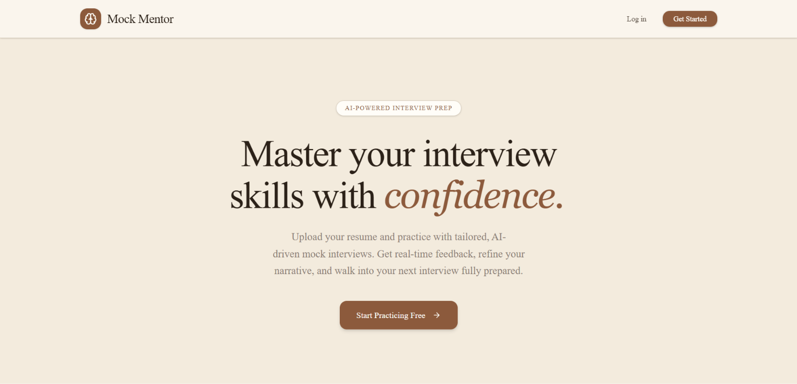

    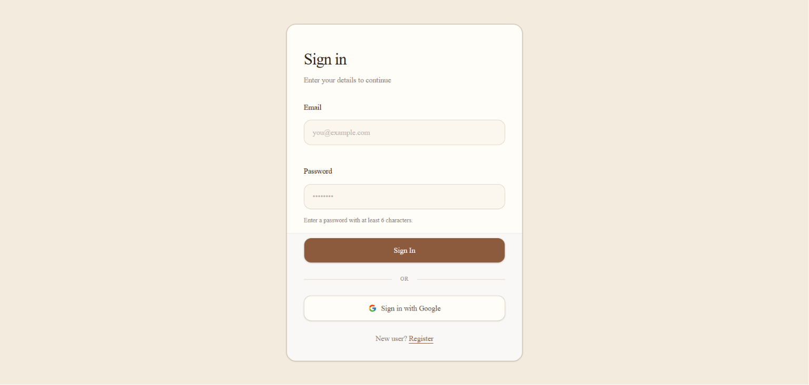

    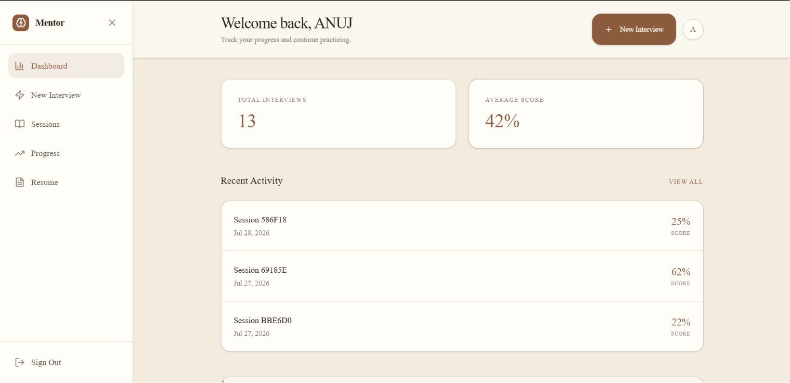

    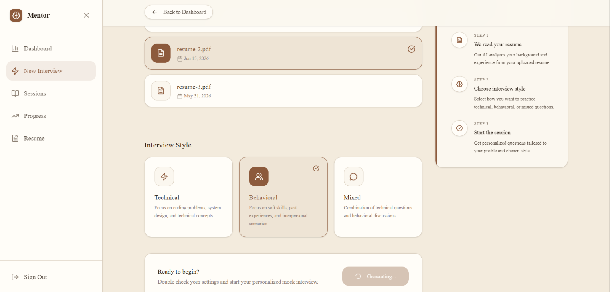

    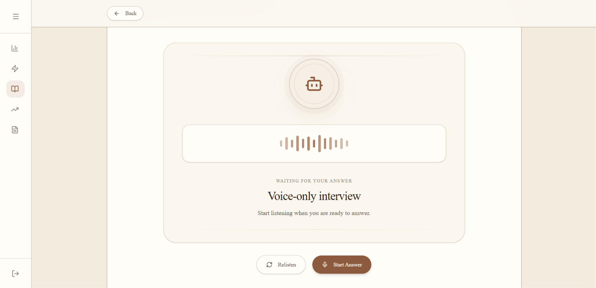

    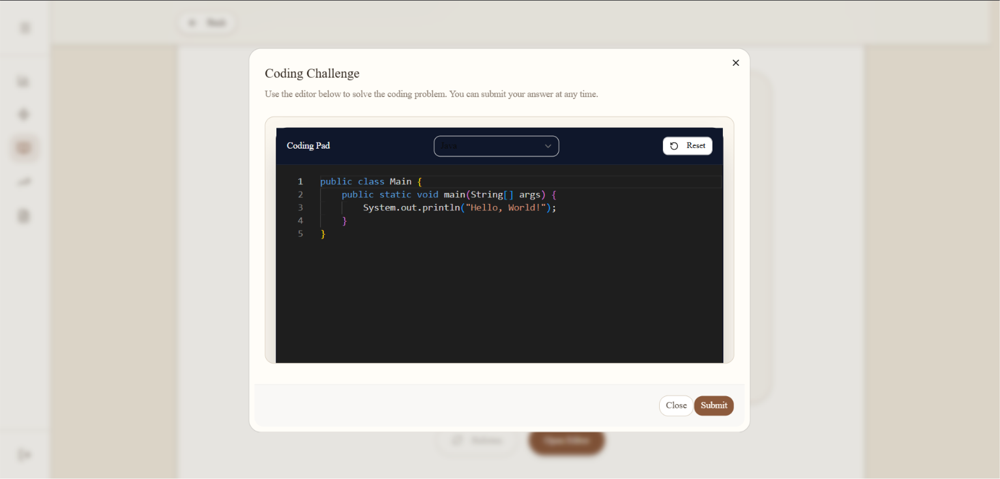

    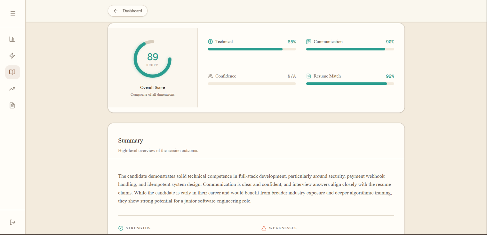

    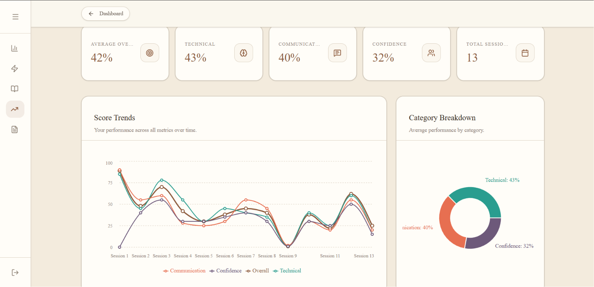

    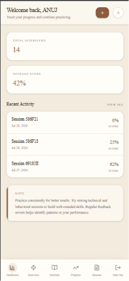

## Features

### Authentication

Mock Mentor provides a secure account experience for both returning users and new sign-ups. Users can authenticate through credentials or Google OAuth, and their interview history, resumes, and reports are scoped to their own account. This creates a personalized workspace rather than a shared, anonymous experience.

### Resume Management

The platform allows users to upload resumes, store them securely, and reuse them across multiple interview sessions. Resume content is parsed and indexed so that future interview questions can be grounded in the user’s background rather than generic practice prompts. This makes the experience more relevant and realistic for each candidate.

### Interview Engine

The interview flow is built around a guided, adaptive experience. Users choose the interview style they want to practice—technical, behavioral, or mixed—and begin a session tailored to that selection. The system generates an initial question, evaluates the response, and continues the conversation with follow-up questions that deepen the interaction.

### Voice Interaction

Mock Mentor includes a voice-first interview experience that supports spoken responses and transcription. The system can speak interview prompts aloud and accept spoken answers, making the experience closer to an actual conversation with a recruiter or hiring manager.

### Reports & Analytics

Each completed interview can generate a structured feedback report. These reports include performance dimensions such as overall readiness, technical clarity, communication quality, confidence, and resume alignment. The goal is to provide enough detail for users to understand not only where they performed well, but where they should improve.

### Session Management

Users can review past sessions, continue active ones, and track their progress over time. The dashboard presents a concise summary of interview activity and recent performance so users can build momentum and identify improvement patterns.

## System Architecture

Mock Mentor is built as a layered application with a clear separation between the presentation layer, API layer, business logic, and data persistence. The frontend is responsible for guiding the user through onboarding, resume management, interviews, and reports, while the backend coordinates session creation, state management, and report generation.

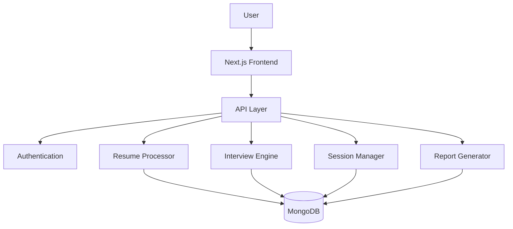

The architecture is intentionally modular. Each major capability is isolated so the application can evolve independently as new features are introduced. The frontend is lightweight and focused on experience, while the backend handles orchestration and persistence in a structured manner.

## Interview Pipeline

The interview experience is designed as a continuous workflow rather than a one-shot questionnaire.

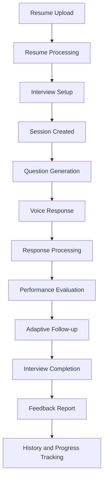

Each stage contributes to a more realistic interview simulation. A resume is first processed into structured context, then used to create a tailored interview session. During the session, questions are generated, answers are collected, and the system evaluates the response. The flow can continue with follow-up questions and eventually concludes with a report that can be reviewed later.

## Core Components

### Resume Processor

The resume processor handles upload validation, text extraction, and storage. It transforms a user-submitted resume into usable context for the interview experience and ensures that the application can personalize future sessions.

### Interview Engine

The interview engine coordinates the interview lifecycle. It selects the initial question, manages follow-ups, handles dynamic progression, and ensures the conversation remains relevant to the user’s chosen interview style.

### Evaluation Engine

The evaluation layer is responsible for turning raw interview responses into structured signals. It produces scores and qualitative insights that guide follow-up behavior and final report generation.

### Session Manager

The session manager tracks the state of each interview, including whether it is active or completed, which questions were asked, and how the conversation progressed. It ensures that the app can recover and continue a session in a coherent way.

### Report Generator

The report generator turns interview data into a summary of strengths, weaknesses, areas for improvement, and overall readiness. This is the component that turns a conversational session into a useful preparation artifact.

### Dashboard

The dashboard provides a high-level view of the user’s interview history and progress. It surfaces recent activity, aggregate score trends, and easy entry points to continue practicing.

### Voice Interface

The voice interface connects the interview experience to speech input and audio output. It allows the product to move beyond text-only interaction and feel closer to a real interview setting.

## Database Design

Mock Mentor uses MongoDB as its primary data store. The data model is designed around a few core entities that are linked through relational references rather than a flat, unstructured structure.

```text
User
├── Resumes
├── Sessions
└── Reports

Session
├── Resume
├── Questions
├── Answers
├── Scores
└── Report
```

Each user can own multiple resumes and multiple interview sessions. Each session references a resume and may eventually produce one report. This schema enables the application to preserve context over time while keeping the data model simple enough to scale and maintain.

## Folder Structure

```text
src/
├── app/
│   ├── api/                 # Application endpoints for auth, resumes, sessions, transcription, and reports
│   ├── (app)/               # Protected application pages
│   └── auth/                # Authentication pages
├── components/              # Reusable UI building blocks
├── hooks/                   # Custom hooks for speech and audio interaction
├── lib/                     # Shared infrastructure and integrations
├── model/                   # Mongoose schemas and data models
├── schemas/                 # Validation schemas
└── types/                   # Shared TypeScript declarations
```

## API Overview

The API layer is responsible for orchestrating the application’s main workflows.

- Authentication routes handle sign-in, registration, and session creation.
- Resume routes manage upload, listing, parsing, and deletion.
- Session routes create new interviews, retrieve session history, and manage question progression.
- Report routes generate and retrieve structured feedback after a session completes.
- Transcription and speech routes support voice-based interaction.

## Tech Stack

### Frontend

- Next.js for a production-ready app router experience and server-rendered application structure
- React for interactive UI components and state-driven interfaces
- TypeScript for safer component and API development
- Tailwind CSS for rapid, maintainable styling
- shadcn/ui for reusable interface primitives

### Backend

- Next.js API routes for server-side application logic
- Mongoose for schema-driven MongoDB access
- NextAuth for secure authentication flows

### Database

- MongoDB for persisting users, resumes, sessions, and reports

### Authentication

- Credentials-based authentication and Google OAuth support for a flexible sign-in experience

### Storage

- Cloudinary is used to store uploaded resume assets securely and persistently

### Speech

- Speech-to-text and text-to-speech services are integrated to support voice interaction in the interview experience

### AI

- Language models are used internally to power resume-aware interview generation, response evaluation, and report creation

### Validation

- Zod is used to validate request payloads and enforce strong input contracts

### Styling

- Tailwind CSS and component-based UI patterns were chosen to keep the interface consistent, responsive, and easy to extend

## Engineering Challenges

Several product and engineering challenges shaped the implementation of Mock Mentor.

- Maintaining interview state across a multi-step conversational experience
- Making the interview flow resume-aware rather than generic
- Persisting sessions and reports reliably for later review
- Synchronizing speech input, transcription, and assistant responses without breaking the conversation flow
- Designing a backend structure that can support future expansion without becoming tightly coupled
- Ensuring proper error handling for asynchronous AI-driven processing and external service integration
- Building a reusable API contract for interview orchestration and reporting

## Future Improvements

The current platform establishes a strong foundation for a more advanced interview experience. Planned improvements include:

- Real-time streaming for more natural conversational interaction
- Deeper interview analytics and score trends over time
- Difficulty adjustment based on historical performance
- Company-specific interview preparation paths
- Collaborative or multi-user interview scenarios
- Expanded code editor integration for technical interviews
- Video-based interview practice

## Environment Variables

| Variable | Purpose |
| --- | --- |
| `MONGODB_URL` | MongoDB connection string |
| `NEXTAUTH_SECRET` | Secret used by NextAuth |
| `GOOGLE_CLIENT_ID` | Google OAuth client ID |
| `GOOGLE_CLIENT_SECRET` | Google OAuth client secret |
| `GEMINI_API_KEY` | API key for the language model provider |
| `OPENROUTER_API_KEY` | API key for evaluation and report generation |
| `ASSEMBLY_API_KEY` | Speech-to-text service key |
| `ELEVENLABS_API_KEY` | Text-to-speech service key |
| `CLOUDINARY_CLOUD_NAME` | Cloudinary cloud name |
| `CLOUDINARY_API_KEY` | Cloudinary API key |
| `CLOUDINARY_API_SECRET` | Cloudinary API secret |

## Installation

```bash
npm install
```

## Running Locally

```bash
npm run dev
```

Then open http://localhost:3000 in your browser.

## Production Build

```bash
npm run build
npm run start
```

## License

This project is intended for personal, educational, and portfolio use unless a separate commercial license is provided.
